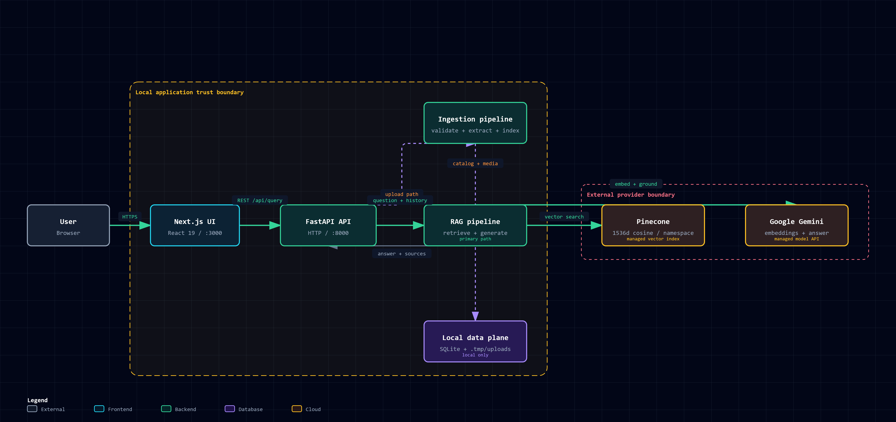
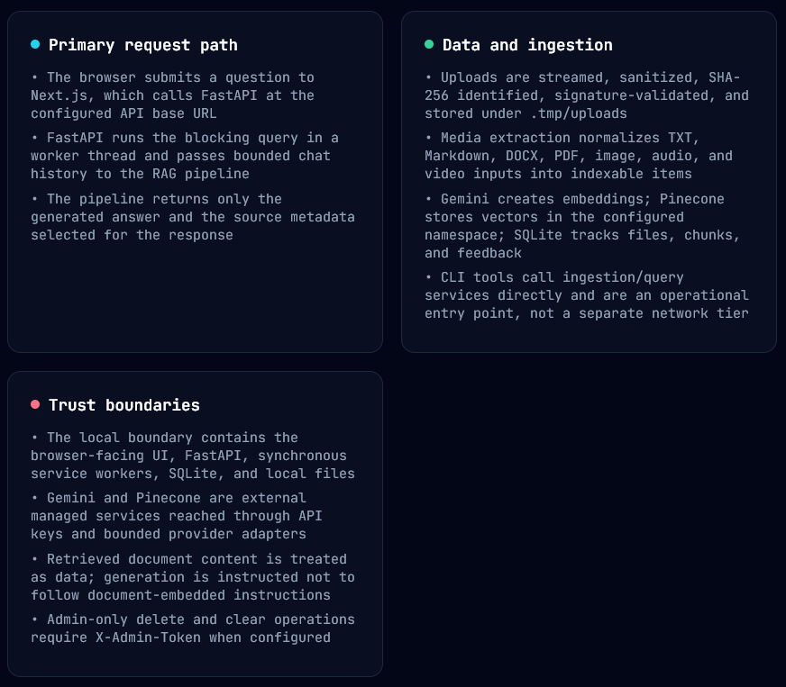

# RAG Multimodal

MVP local de RAG multimodal para consultar documentos, imagens, PDFs, áudios e vídeos com respostas fundamentadas e fontes verificáveis.

O projeto recebe arquivos, extrai e normaliza seu conteúdo, gera embeddings, recupera os trechos mais relevantes e usa o Gemini para produzir respostas apoiadas nas evidências encontradas. O catálogo, os uploads e os arquivos derivados ficam localmente; o Gemini e o Pinecone são serviços externos usados para processamento e busca vetorial.

> Status: MVP funcional para uso local. OCR externo, transcrição de áudio/vídeo, autenticação de usuários e deploy em produção ainda não fazem parte do escopo atual.

## Arquitetura

<p align="center">
  
</p>

<p align="center">
  Arquitetura do RAG Multimodal
</p>

<p align="center">
  
</p>

<p align="center">
  Divisão Arquitetural do RAG Multimodal
</p>

Consulte o [diagrama de arquitetura de runtime](docs/runtime-architecture.html) para uma visão interativa da comunicação entre frontend, backend, armazenamento local, Gemini e Pinecone.

```text
Next.js 16 / React              FastAPI
sidebar + chat + fontes  <----> upload, query, feedback
localStorage                    SQLite + storage local
                                      |
                              Gemini + Pinecone
```

O backend segue a separação WAT: `workflows/` documenta runbooks, `tools/` contém wrappers CLI pequenos e a lógica vive em `core/`, `db/` e `services/`.

## Tecnologias e pré-requisitos

- Python + FastAPI para a API e os processos de ingestão/consulta;
- Next.js 16, React 19 e TypeScript para a interface web;
- SQLite para o catálogo local e armazenamento em `.tmp/` para uploads e derivados;
- Google Gemini para embeddings e geração de respostas;
- Pinecone para busca vetorial;
- PyMuPDF, `python-docx`, Pillow, OpenCV e Mutagen para leitura e validação de mídia;
- pytest e Ruff no backend; ESLint, TypeScript e Next.js no frontend.

Para executar o projeto, também é necessário:

- Python 3.12 ou superior (testado localmente com Python 3.13);
- Node.js 20.9 ou superior (testado localmente com Node 24);
- npm 10 ou superior;
- chave da API Gemini;
- chave da API Pinecone;
- Windows, Linux e macOS.

## Instalação

### Backend

Windows PowerShell:

```powershell
python -m venv .venv
.venv\Scripts\Activate.ps1
pip install -r requirements.txt
Copy-Item .env.example .env
```

Linux/macOS:

```bash
python -m venv .venv
source .venv/bin/activate
pip install -r requirements.txt
cp .env.example .env
```

Preencha `GOOGLE_API_KEY` e `PINECONE_API_KEY` no `.env`. Não versione `.env`.

### Docker

O `Dockerfile` cria uma imagem somente para o backend FastAPI. O frontend Next.js continua sendo executado separadamente, conforme as instruções abaixo.

Com o Docker em execução, na raiz do projeto:

```bash
docker build -t rag-multimodal-backend .
docker run --rm --name rag-multimodal-backend --env-file .env -p 10000:10000 rag-multimodal-backend
```

O backend ficará disponível em `http://localhost:10000`. Para manter o banco SQLite, os uploads e os arquivos derivados fora do container, monte `.tmp` como volume:

PowerShell:

```powershell
docker run --rm --name rag-multimodal-backend --env-file .env -p 10000:10000 -v "${PWD}\.tmp:/app/.tmp" rag-multimodal-backend
```

Linux/macOS:

```bash
docker run --rm --name rag-multimodal-backend --env-file .env -p 10000:10000 -v "$(pwd)/.tmp:/app/.tmp" rag-multimodal-backend
```

Para usar esse backend no frontend, configure `NEXT_PUBLIC_API_BASE_URL=http://localhost:10000` em `frontend/.env.local` antes de iniciar `npm run dev`. Verifique a execução em `http://localhost:10000/api/health`.

### Frontend

PowerShell:

```powershell
cd frontend
npm install
Copy-Item .env.local.example .env.local
```

Linux/macOS:

```bash
cd frontend
npm install
cp .env.local.example .env.local
```

O frontend usa `NEXT_PUBLIC_API_BASE_URL=http://localhost:8000` por padrão.

## Pinecone

Crie ou valide o índice de forma idempotente:

```bash
python tools/setup_pinecone.py
```

O índice é dense, 1536 dimensões, cosine, AWS `us-east-1`. A aplicação manipula apenas o namespace configurado em `PINECONE_NAMESPACE` e nunca recria automaticamente um índice incompatível.

## Execução

Backend:

```bash
# Windows PowerShell (sem depender do Python global)
.venv\Scripts\python.exe -m uvicorn api.server:app --reload --host 127.0.0.1 --port 8000

# Linux/macOS
.venv/bin/python -m uvicorn api.server:app --reload --host 127.0.0.1 --port 8000
```

No Windows, também é possível ativar o ambiente antes e usar `python -m uvicorn`:

```powershell
.venv\Scripts\Activate.ps1
python -m uvicorn api.server:app --reload --host 127.0.0.1 --port 8000
```

Frontend:

```bash
cd frontend
npm run dev
```

Acesse `http://localhost:3000`.

Com os dois processos em execução, use a interface para enviar um arquivo, aguarde o status `ready` e faça uma pergunta no chat. A resposta exibe as fontes utilizadas. Para verificar o backend diretamente, consulte `http://127.0.0.1:8000/api/health`.

## Formatos e limites

Suportados: `.txt`, `.md`, `.docx`, `.pdf`, `.png`, `.jpg`, `.jpeg`, `.gif`, `.webp`, `.mp4`, `.mov`, `.mp3` e `.wav`.

O limite padrão é 100 MB, PDFs têm limite de 200 páginas, áudios de 180 segundos e vídeos de 120 segundos. GIFs usam apenas o primeiro frame; WebP e GIF são normalizados para JPEG; a faixa de áudio interna de vídeos não é indexada; não há transcrição nem OCR externo.

## CLI

```bash
python tools/ingest.py documentos/
python tools/ingest.py contrato.pdf --force
python tools/query_rag.py "Qual é o prazo definido no contrato?"
python tools/query_rag.py "Quais são as obrigações?" --file-type pdf
python tools/query_rag.py "Mostre apenas as evidências" --mode evidence
```

## Testes e qualidade

Backend:

```bash
ruff check .
pytest -q
```

Frontend:

```bash
cd frontend
npm run lint
npm run typecheck
npm run build
```

O comando `npm run build` valida a compilação de produção, mas não inicia o servidor; para iniciar uma build já compilada, use `npm run start` dentro de `frontend`.

`requirements.lock.txt` contém as versões Python exatas geradas após a instalação. `frontend/package-lock.json` é mantido pelo npm.

## Compartilhamento seguro do código-fonte

Valide o repositório e gere um pacote somente com arquivos versionados:

```bash
python tools/package_source.py --check
python tools/package_source.py --output dist/Agent-RAG-source.zip
```

Nunca compacte manualmente a pasta inteira do projeto.
Nunca compartilhe `.env`, `.tmp`, `.venv`, `node_modules` ou `.next`.

## Segurança local

- uploads são gravados por streaming, com SHA-256, nome sanitizado e assinatura real;
- caminhos absolutos não entram no SQLite, Pinecone ou respostas da API;
- SQL usa parâmetros e o frontend não envia filtros Pinecone arbitrários;
- erros não expõem stack traces, chaves, tokens, vetores ou conteúdo integral;
- `DELETE /api/files/{doc_id}` e `DELETE /api/index` exigem `X-Admin-Token` quando `ADMIN_TOKEN` estiver configurado;
- em `APP_ENV=production`, `ADMIN_TOKEN` é obrigatório;
- conteúdo indexado é tratado como dado, nunca como instrução de sistema.

## Exclusão

Excluir um arquivo remove vetores, catálogo, original e derivados somente depois da exclusão externa ser confirmada. Limpar o índice exige a confirmação `DELETE_ALL` e apaga somente os vetores do namespace configurado; o índice Pinecone não é destruído.

## Estrutura

- `api/`: FastAPI, schemas e dependências;
- `core/`: configuração, exceções e logging;
- `db/`: migrations e catálogo SQLite;
- `services/`: storage, mídia, chunking, ingestão, embeddings, Pinecone, retrieval e generation;
- `tools/`: CLIs determinísticos;
- `frontend/`: aplicação Next.js;
- `.tmp/`: uploads, derivados e banco descartáveis;
- `workflows/`: runbooks operacionais.

## Troubleshooting

- Health `degraded`: confirme que o backend está rodando e que `.env` está no diretório raiz.
- Gemini/Pinecone não configurados: a aplicação inicia, mas ingestão e consulta retornam erro seguro.
- Índice incompatível: revise dimensão, métrica, cloud, região e namespace; a aplicação não recria o índice automaticamente.
- Arquivo rejeitado: confirme extensão, MIME real, assinatura, tamanho e duração.
- Para reprocessar arquivo com status `failed`, use `--force` no CLI.

## Licença

Este projeto está licenciado sob a licença MIT. Consulte o arquivo
[LICENSE](LICENSE) para obter mais informações.
