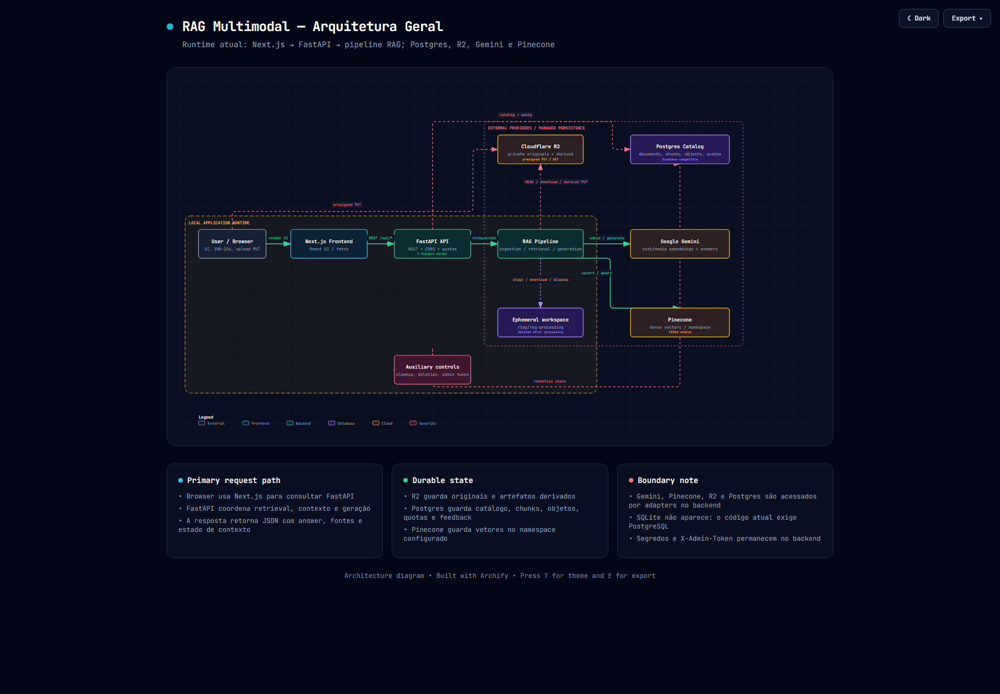
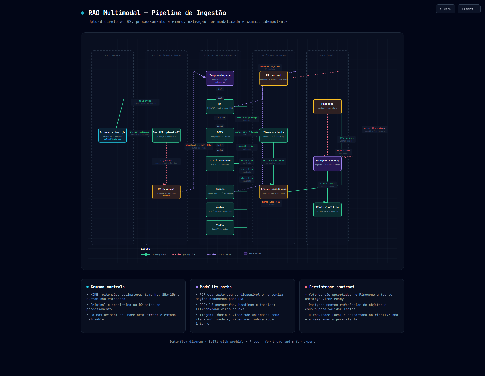
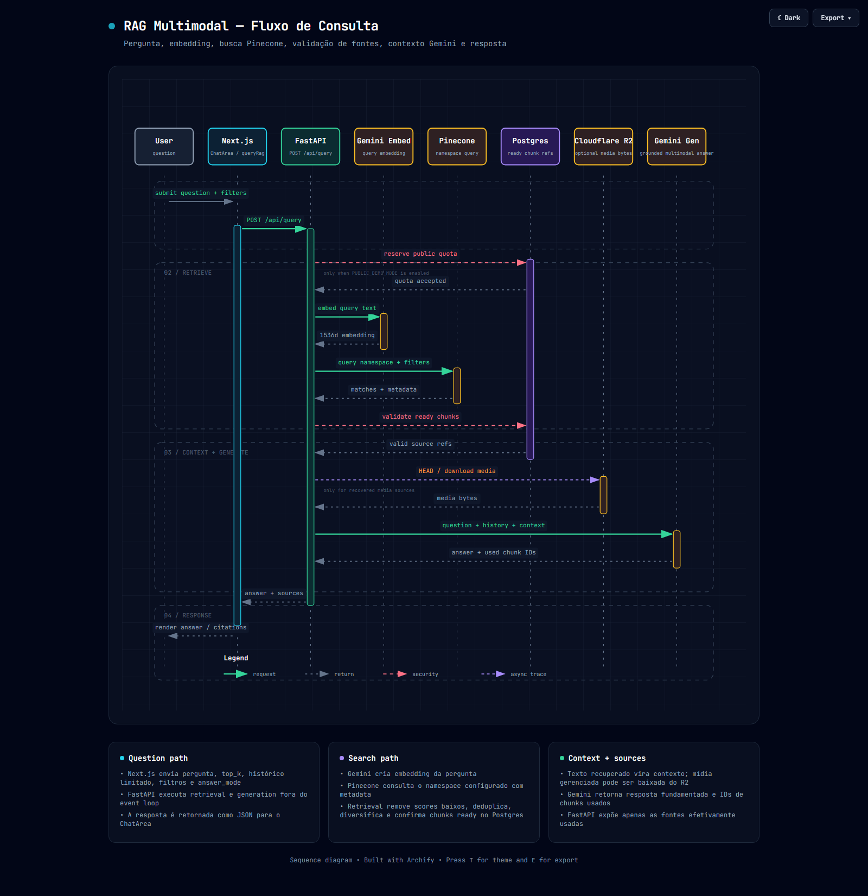
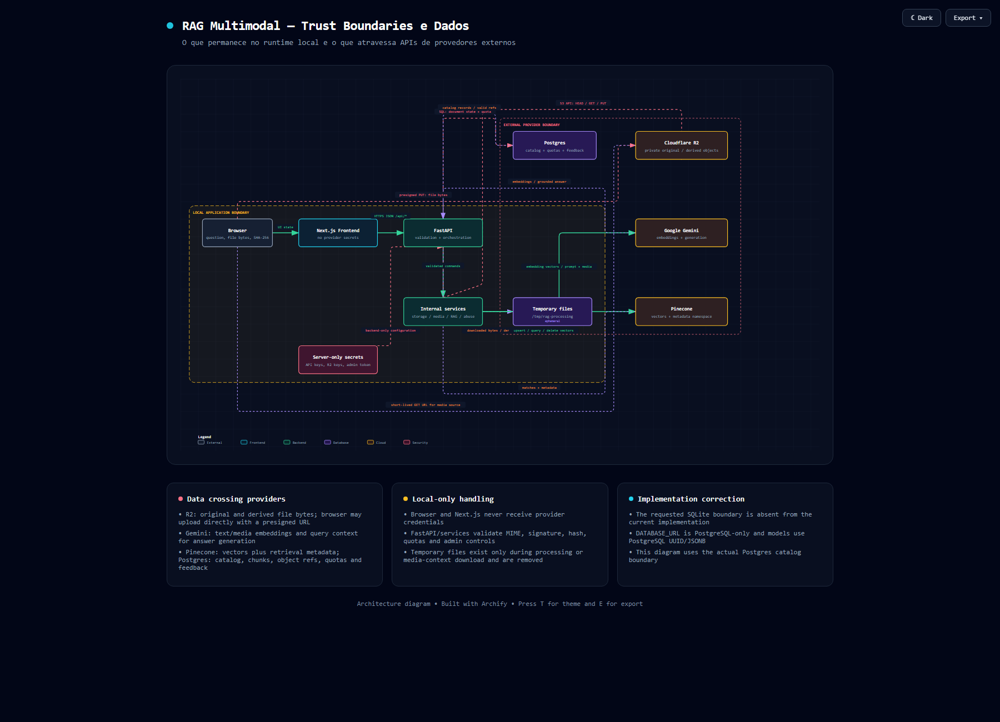
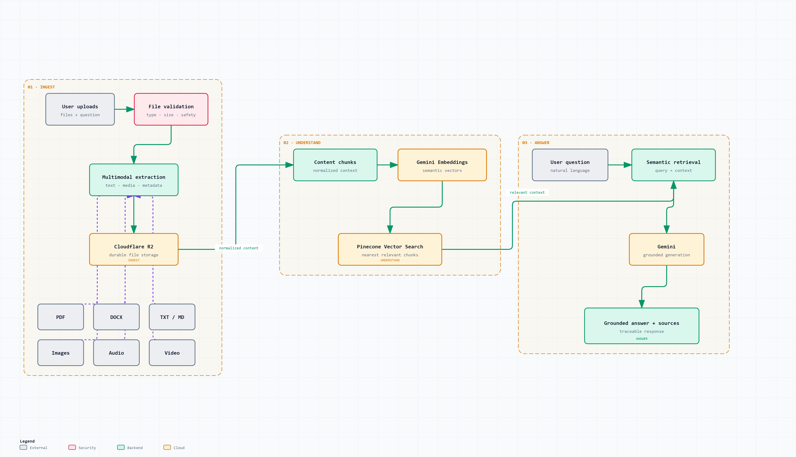

# RAG Multimodal

Um sistema RAG multimodal para consultar documentos, imagens, PDFs, áudio e vídeo com respostas fundamentadas e fontes verificáveis.

O projeto combina uma interface Next.js com uma API FastAPI. Arquivos são enviados diretamente do navegador para um bucket privado no Cloudflare R2; o backend processa cada objeto em um workspace efêmero, extrai e normaliza o conteúdo, gera embeddings com o Google Gemini, indexa os vetores no Pinecone e mantém o catálogo no Supabase Postgres. As perguntas seguem o caminho inverso: recuperação semântica, validação das fontes e geração de uma resposta fundamentada.

> Status: MVP funcional preparado para execução local e deploy em Render Free + Supabase Postgres + Cloudflare R2 + Pinecone + Gemini.

## O que o projeto faz

- Recebe arquivos por upload direto ao R2 usando URLs pré-assinadas.
- Processa texto, Markdown, DOCX, PDF, imagens, áudio e vídeo.
- Extrai texto, páginas renderizadas e metadados conforme a modalidade.
- Gera embeddings de 1536 dimensões e indexa chunks no Pinecone.
- Recupera fontes por similaridade, deduplica resultados e confirma seu estado no Postgres.
- Envia pergunta, histórico limitado e contexto recuperado ao Gemini.
- Retorna uma resposta com as fontes efetivamente usadas.
- Aplica quotas persistentes para a demonstração pública sem expor credenciais no navegador.

O fluxo central é:

```text
Arquivos entram
  → conteúdo multimodal é processado
  → conhecimento é indexado
  → perguntas são recuperadas semanticamente
  → Gemini gera respostas fundamentadas com fontes
```

OCR externo, transcrição de áudio/vídeo e autenticação de usuários não fazem parte do escopo atual do MVP. GIF usa o primeiro frame, WebP e GIF são normalizados para JPEG, e a faixa de áudio interna de vídeos não é indexada.

## Arquitetura

A arquitetura foi documentada com [Archify](https://github.com/tt-a1i/archify), uma skill para agentes que gera diagramas de arquitetura autocontidos a partir de descrições do sistema.

Os diagramas abaixo foram gerados a partir da implementação real deste repositório e revisados contra o código, os scripts de execução e as dependências de runtime. Eles fazem parte do processo de documentação de engenharia: cada diagrama destaca uma pergunta diferente sobre o sistema e não representa uma arquitetura idealizada.

### Arquitetura do sistema



- [Abrir diagrama interativo da arquitetura geral](docs/architecture/01-system-architecture.html)
- [Abrir a especificação Archify](docs/architecture/01-system-architecture.architecture.json)

### Pipeline de ingestão multimodal



- [Abrir diagrama interativo do pipeline de ingestão](docs/architecture/02-multimodal-ingestion.html)
- [Abrir a especificação Archify](docs/architecture/02-multimodal-ingestion.dataflow.json)

O upload segue a sequência `presign → PUT direto no R2 → complete → download temporário → extração/normalização → embeddings → Pinecone → catálogo Postgres em estado ready`. O filesystem local não é uma camada de persistência.

### Fluxo de consulta RAG



- [Abrir diagrama interativo do fluxo de consulta](docs/architecture/03-rag-query.html)
- [Abrir a especificação Archify](docs/architecture/03-rag-query.sequence.json)

### Trust boundaries



- [Abrir diagrama interativo de trust boundaries](docs/architecture/04-trust-boundaries.html)
- [Abrir a especificação Archify](docs/architecture/04-trust-boundaries.architecture.json)

O diagrama deixa explícito que chaves de API, credenciais do R2 e `ADMIN_TOKEN` permanecem no backend. O navegador recebe apenas contratos públicos e URLs pré-assinadas de curta duração. A fronteira de persistência usa PostgreSQL; SQLite não faz parte do runtime atual.

### Arquitetura de segurança: isolamento por visitante anônimo

O sistema não exige login, mas todo visitante anônimo recebe um escopo lógico próprio. No primeiro request, o FastAPI gera um UUIDv4 e o persiste no cookie HttpOnly assinado `rag_visitor_id`. O valor é validado pelo backend com HMAC-SHA256 e não é derivado de IP, user-agent ou qualquer outro identificador de rede.

```text
Visitor
  ↓
Visitor Identity
  ↓
FastAPI
  ↓
Visitor-scoped persistence
  ↓
Visitor-scoped R2 object
  ↓
Visitor-scoped Pinecone namespace/filter
  ↓
RAG retrieval
  ↓
Generated Response
  ↓
Persisted response_id
  ↓
Feedback validation
```

As regras são:

1. Cada visitante recebe um identificador persistente no cookie assinado `rag_visitor_id`.
2. O identificador não é baseado em IP e nunca é aceito como um campo de autorização enviado pelo cliente.
3. Documentos, estados de upload, chunks, conversas e mensagens são associados ao `visitor_id` resolvido pelo middleware.
4. O retrieval vetorial usa um namespace Pinecone derivado no backend e um filtro de metadata para o mesmo visitante.
5. O histórico de conversas é consultado e apagado somente dentro do escopo do visitante atual.
6. Feedback só pode ser enviado para uma resposta realmente gerada e persistida pelo pipeline deste sistema.
7. A resposta bem-sucedida recebe um `response_id` persistido, que corresponde ao `message_id` da mensagem armazenada.
8. Antes de ler, alterar, excluir ou vincular dados, o backend valida ownership; IDs, cookies, namespaces e object keys fornecidos pelo cliente não substituem essa validação.

O fluxo de feedback é deliberadamente fechado: `POST /api/query` persiste a resposta antes de devolver seu `response_id`; `POST /api/feedback` procura esse ID junto ao visitante atual e rejeita respostas inexistentes ou pertencentes a outro visitante. Detalhes do contrato estão em [docs/FEEDBACK.md](docs/FEEDBACK.md), e a análise técnica está em [docs/SECURITY_AUDIT_VISITOR_ISOLATION.md](docs/SECURITY_AUDIT_VISITOR_ISOLATION.md).

### Versão visual simplificada



Uma versão mais compacta, adequada para apresentação e portfólio, está disponível em [PNG](docs/architecture/social-agent-rag.png), [SVG](docs/architecture/social-agent-rag.svg) e [HTML interativo](docs/architecture/social-agent-rag.html).

Para instalar o Archify globalmente em um agente Codex:

```powershell
npx skills add tt-a1i/archify -g
```

Para uso temporário:

```powershell
npx skills use tt-a1i/archify@archify --agent codex
```

## Tecnologias

- **Frontend:** Next.js 16, React 19, TypeScript, Tailwind CSS e `react-markdown`.
- **Backend:** Python 3.12, FastAPI, Uvicorn, Pydantic Settings e SQLAlchemy assíncrono.
- **Persistência:** Supabase Postgres, asyncpg e Alembic.
- **Arquivos:** Cloudflare R2 privado via API S3 compatível e boto3.
- **Busca vetorial:** Pinecone Serverless dense, dimensão 1536 e métrica cosine.
- **IA:** Google Gemini para embeddings multimodais e geração de respostas.
- **Mídia:** PyMuPDF, python-docx, Pillow, OpenCV, Mutagen e FFmpeg.
- **Runtime:** Docker com `python:3.12-slim-bookworm`, usuário não-root e um worker Uvicorn.

## Como rodar localmente

### Pré-requisitos

- Python 3.12 ou superior;
- Node.js 20.9 ou superior e npm 10 ou superior;
- PostgreSQL acessível;
- credenciais do Gemini, Pinecone e Cloudflare R2;
- Docker Desktop apenas para o fluxo containerizado.

### 1. Instalar e configurar o backend

Na raiz do repositório:

```powershell
python -m venv .venv
.venv\Scripts\Activate.ps1
pip install -r requirements.txt
Copy-Item .env.example .env
```

Preencha `.env` com os valores do seu ambiente. Nunca versione credenciais. `DATABASE_URL` deve apontar para PostgreSQL; SQLite não é suportado.

### 2. Aplicar as migrations

Com `DATABASE_URL` configurada:

```powershell
python -m alembic upgrade head
```

### 3. Iniciar o backend

Em um terminal PowerShell, na raiz:

```powershell
.venv\Scripts\python.exe -m uvicorn api.server:app --reload --no-access-log --host 127.0.0.1 --port 8000
```

Verifique `http://localhost:8000/api/health` antes de testar uploads ou consultas.

### 4. Iniciar o frontend

Em outro terminal PowerShell:

```powershell
cd frontend
npm ci
Copy-Item .env.local.example .env.local
npm run dev
```

O `.env.local` deve conter `NEXT_PUBLIC_API_BASE_URL=http://localhost:8000`. A aplicação fica disponível em `http://localhost:3000`.

## Rodar com Docker

O container instala as dependências de mídia, executa como usuário `app`, aplica as migrations antes do startup e mantém somente arquivos intermediários em `/tmp/rag-processing`. O entrypoint inicia um único worker Uvicorn na porta `10000` ou na porta fornecida por `PORT`.

Com o Docker Desktop ativo, na raiz:

```powershell
docker build -t rag-multimodal-backend .
docker run --rm --name rag-multimodal-backend --env-file .env -p 10000:10000 rag-multimodal-backend
```

O backend estará em `http://localhost:10000`. Para esse modo, use `NEXT_PUBLIC_API_BASE_URL=http://localhost:10000` no frontend. Não use volume para transformar o filesystem do container em armazenamento permanente: os objetos duráveis ficam no R2.

## API principal

O backend cria um visitante anônimo com UUIDv4 e assina o cookie persistente `rag_visitor_id` com HMAC-SHA256. O navegador envia esse cookie HttpOnly com `credentials: include`; UUIDs crus, cookies adulterados e valores vindos do JSON ou `localStorage` não são aceitos como autorização.

Além das rotas de health, arquivos, upload, consulta e feedback, a API expõe `GET /api/session` para inicializar a identidade e `GET/DELETE /api/conversations/{conversation_id}` para histórico persistido somente no escopo do visitante.

- `GET /api/health` — verifica Postgres, R2, Pinecone e Gemini.
- `GET /api/session` — inicializa a identidade anônima persistente sem expor o identificador.
- `GET /api/stats` — retorna estatísticas do catálogo no escopo do visitante.
- `GET /api/files` e `GET /api/files/{doc_id}` — lista documentos e acompanha o processamento.
- `POST /api/uploads/presign` — reserva um upload e cria uma URL PUT pré-assinada.
- `POST /api/uploads/{doc_id}/complete` — confirma o objeto e inicia a ingestão.
- `POST /api/files/{doc_id}/retry` — solicita retry administrativo de um documento com falha; exige `X-Admin-Token`.
- `POST /api/query` — executa retrieval e geração da resposta.
- `POST /api/ingest` — ingestão multipart para CLI, testes e integrações internas.
- `DELETE /api/files/{doc_id}` — remove um documento pertencente ao visitante; em modo não público exige `X-Admin-Token`.
- `DELETE /api/index` — limpeza administrativa do namespace configurado; exige `X-Admin-Token` e confirmação `DELETE_ALL`.
- `GET /api/conversations/{conversation_id}` — carrega histórico pertencente ao visitante.
- `DELETE /api/conversations/{conversation_id}` — exclui histórico pertencente ao visitante.
- `POST /api/feedback` — registra feedback somente de uma resposta persistida e pertencente ao visitante. O contrato e a regra de duplicidade estão em [docs/FEEDBACK.md](docs/FEEDBACK.md).

O FastAPI também publica `/docs`, `/redoc` e `/openapi.json`. Essas rotas descrevem os contratos; não concedem acesso a dados privados. Rotas administrativas não são chamadas pelo frontend público.

O limite público padrão é 10 MB por arquivo. As quotas padrão são 3 uploads por dia e 30 consultas por dia por cliente, com retenção pública de 3 dias. Elas podem ser ajustadas pelas variáveis do backend.

## Deploy e operação

O procedimento completo para Render Free, Supabase Postgres, R2 privado, Pinecone, Gemini, variáveis de ambiente, migrations e checklist de validação está em [docs/DEPLOYMENT_FREE_TIER.md](docs/DEPLOYMENT_FREE_TIER.md).

O container não depende de SQLite, de uploads persistentes ou de disco persistente do Render. Postgres guarda catálogo, estados, quotas e feedback; R2 guarda originais e derivados; Pinecone guarda os vetores; `/tmp/rag-processing` é descartável.

## Testes e qualidade

Backend, na raiz:

```powershell
ruff check .
pytest -q
```

Frontend, em `frontend`:

```powershell
npm ci
npm run lint
npm run typecheck
npm run build
```

Os testes de integração PostgreSQL dependem de `TEST_DATABASE_URL` e `TEST_DATABASE_SCHEMA`. Sem essa configuração, eles são pulados; a suíte não deve ser executada contra o schema `public` de produção.

## Estrutura do repositório

```text
api/                 rotas e contratos HTTP FastAPI
core/                configuração, logging e exceções
db/                  engine, modelos e catálogo PostgreSQL
alembic/             migrations
services/            storage, mídia, ingestão, Gemini e Pinecone
tools/               CLIs operacionais e migração de persistência legada
frontend/            aplicação Next.js exportada como site estático
docker/              entrypoint e runtime do container
docs/architecture/   diagramas Archify e suas especificações
.tmp/                processamento temporário descartável
```

## Segurança e limitações

O isolamento é lógico e por visitante anônimo, não autenticação de usuário. Perder, apagar ou bloquear o cookie pode criar uma nova identidade e tornar a identidade anterior inacessível pelo navegador. O modelo não deve ser apresentado como uma solução de identidade empresarial.

Para produção com usuários autenticados, o `visitor_id` deverá ser substituído por uma identidade autenticada ou associado a ela, com uma política explícita de migração e ownership.

- Documentos novos têm `visitor_id`; chunks herdam o dono do documento, objetos R2 recebem prefixo/metadado do visitante e vetores Pinecone usam namespace derivado no backend (`<PINECONE_NAMESPACE>--visitor_<uuidhex>`) mais metadata/filtro de ownership como defesa em profundidade.
- Dados legados sem dono permanecem em quarentena (`visitor_id IS NULL`) e não aparecem nas rotas públicas; não são atribuídos arbitrariamente a um visitante.

- Segredos de Postgres, R2, Gemini, Pinecone, `VISITOR_SESSION_SECRET` e `ADMIN_TOKEN` ficam somente no backend.
- O bucket R2 é privado e os uploads usam URLs pré-assinadas de curta duração.
- O catálogo Postgres usa RLS sem policies públicas e sem grants da Data API para `anon`/`authenticated`.
- O frontend não recebe `ADMIN_TOKEN` nem outras credenciais de provedor.
- Quotas e retenção reduzem abuso na demonstração pública, mas não substituem autenticação, WAF ou observabilidade de produção.
- Falhas de provedores externos podem deixar documentos em estado recuperável; o retry administrativo não é exposto na interface pública.

## Licença

MIT. Consulte [LICENSE](LICENSE).
